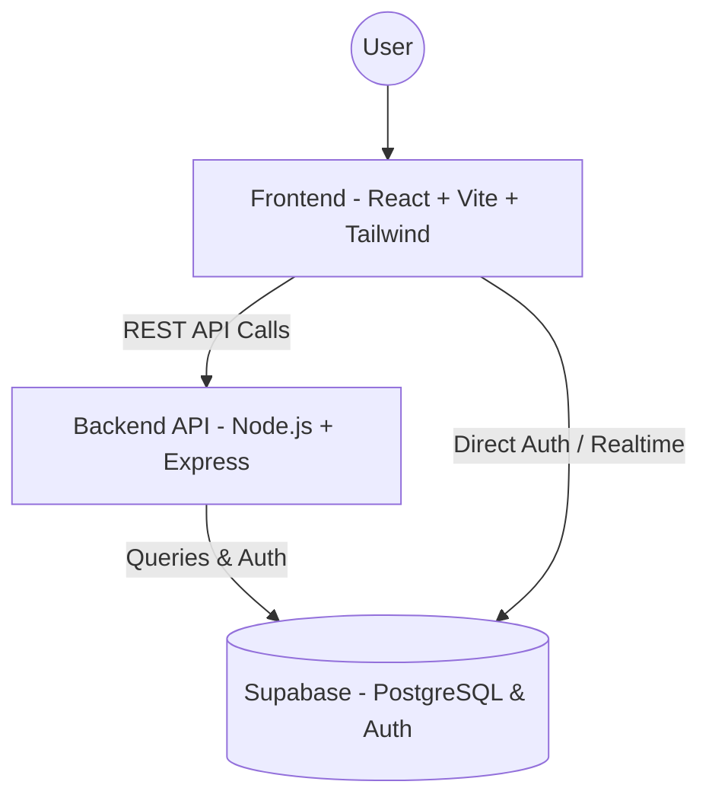

<div align="center">

# 🛠️ TCL Forge
**The Ultimate EDA Learning Platform**

[](https://reactjs.org/)
[](https://vitejs.dev/)
[](https://expressjs.com/)
[](https://supabase.com/)
[](https://tailwindcss.com/)

An interactive, modern web application designed to help users learn Tool Command Language (TCL) specifically geared towards Electronic Design Automation (EDA).

<p align="center">
  <a href="#-features">Features</a> .
  <a href="#-architecture">Architecture</a> .
  <a href="#-tech-stack">Tech Stack</a> .
  <a href="#-getting-started">Getting Started</a> .
  <a href="#-deployment">Deployment</a>
</p>

</div>

---

## ✨ Features

- **📖 Interactive Tutorials:** Step-by-step guides to mastering TCL for EDA.
- **💻 Live TCL Runner:** Execute and test TCL commands in real-time directly from your browser.
- **🧩 Problem Solving & Challenges:** Test your knowledge with hands-on coding challenges.
- **🎓 Interview Prep:** Curated questions and scenarios to prepare you for EDA industry interviews.
- **📝 Personal Notes:** Save and organize your learnings as you progress.
- **🔐 Secure Authentication:** Seamless user login and registration powered by Supabase.

---

## 🏗️ Architecture

TCL Forge follows a modern client-server architecture, utilizing a React frontend, an Express API backend, and Supabase for database and authentication.


### Flow Breakdown
1. **Client Layer:** Users interact with the Vite-powered React application, featuring smooth animations via Framer Motion.
2. **Application Layer (Backend):** The Node.js/Express server acts as an intermediary, processing requests and serving static assets (like notes).
3. **Data Layer:** Supabase provides secure authentication and a robust PostgreSQL database for user progress, challenges, and application data.

---

## 🛠️ Tech Stack

### Frontend
- **React.js** (v18)
- **Vite** for lightning-fast HMR and building
- **Tailwind CSS** for utility-first styling
- **Framer Motion** for fluid animations
- **React Router** for declarative routing

### Backend
- **Node.js** & **Express.js**
- **CORS** & **Dotenv** for environment management
- Concurrently to manage monolithic dev server execution

### Database & Auth
- **Supabase** (PostgreSQL)

### Deployment
- **Render** configured via `render.yaml` for both static frontend delivery and backend web service hosting.

---

## 🚀 Getting Started

### Prerequisites
Make sure you have the following installed on your machine:
- [Node.js](https://nodejs.org/en/) (v16 or higher)
- npm (comes with Node.js)
- A [Supabase](https://supabase.com/) account and project.

### Installation

1. **Clone the repository**
   ```bash
   git clone https://github.com/yourusername/tclforge.git
   cd tclforge
   ```

2. **Install all dependencies**
   We have provided a script to install root, frontend, and backend dependencies at once:
   ```bash
   npm run install:all
   ```

### Environment Variables

You need to set up your `.env` variables for both the backend and frontend.

**Backend (`backend/.env`):**
```env
PORT=5000
CLIENT_URL=http://localhost:5173
SUPABASE_URL=your_supabase_url
SUPABASE_ANON_KEY=your_supabase_anon_key
SUPABASE_SERVICE_ROLE_KEY=your_supabase_service_role_key
```

**Frontend (`frontend/.env`):**
```env
VITE_API_URL=http://localhost:5000/api
```
*(Check `.env.example` files if available for more details).*

### Running the App Locally

To start both the frontend and backend development servers concurrently, simply run from the root directory:

```bash
npm run dev
```

- **Frontend:** http://localhost:5173
- **Backend API:** http://localhost:5000
- **Health Check:** http://localhost:5000/health

---

## ☁️ Deployment

TCL Forge is configured for deployment on **Render** using a Blueprint (`render.yaml`).

1. Connect your repository to Render.
2. Render will automatically detect the `render.yaml` file.
3. It will provision:
   - A static site for the **frontend**.
   - A web service for the **backend**.
4. Make sure to add your environment variables (`SUPABASE_URL`, `SUPABASE_ANON_KEY`, etc.) in the Render dashboard.

---

<div align="center">
  <i>Built with ❤️ for the EDA community.</i>
</div>
